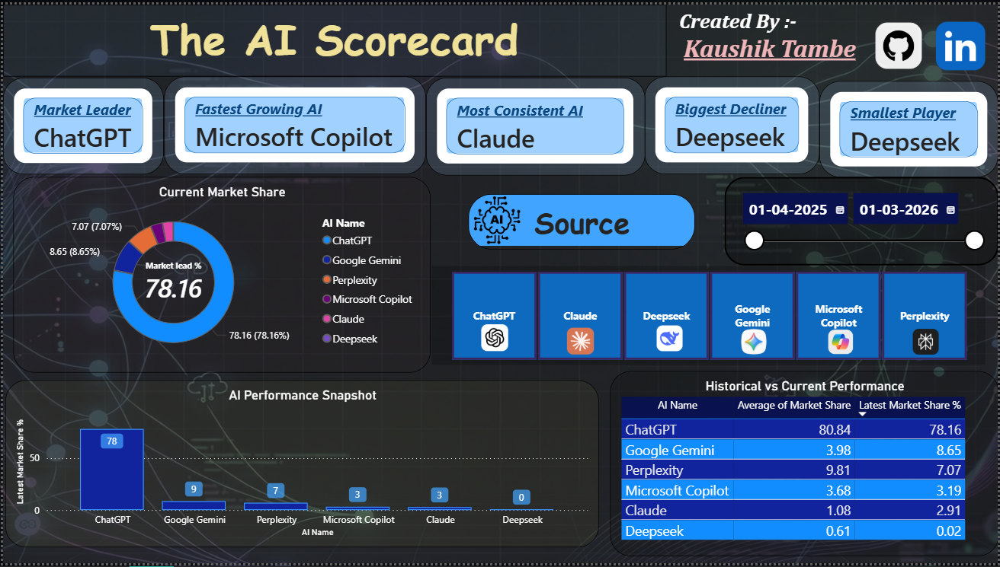

# 🤖 The AI Scorecard — Power BI Dashboard

## 📊 Project Overview
A live interactive Power BI dashboard tracking and comparing 
the market performance of the world's top 6 AI chatbots —
ChatGPT, Google Gemini, Microsoft Copilot, Claude, 
Perplexity and Deepseek.

Built to answer one simple question —
**Who is actually winning the AI race?**

---

## 🎯 KPIs Built
- 🥇 Market Leader — who dominates right now
- 🚀 Fastest Growing AI — biggest threat to the leader
- 📉 Biggest Decliner — who is losing ground fast
- 🎯 Most Consistent AI — who stays stable regardless of trends
- 📊 Smallest Player — the underdog of the market

---

## 💡 Key Insights
- ChatGPT still dominates at 78% market share
- Microsoft Copilot grew 1,287% in 12 months 🤯
- Deepseek collapsed by 97% after initial hype
- Claude is the most consistent — barely moves month to month
- Google Gemini quietly quadrupled its market share

---

## 🛠️ Tools & Technologies
- **Power BI** — Dashboard design and visualization
- **DAX** — Custom KPI measures
- **Power Query** — Data transformation and cleaning
- **GitHub** — Live data pipeline
- **Statcounter Global Stats** — Data source

---

## 📐 DAX Measures
- MAXX + TOPN + FILTER — Market Leader & Fastest Growing
- MINX + TOPN + ASC — Biggest Decliner & Most Consistent
- STDEVX.P — Consistency Scoring
- DIVIDE — Growth % Calculation
- CALCULATE + MAX — Latest Month Filter

---

## ⚙️ Power Query Transformations
- List.Sum — Row level validation
- Zero row filtering — automatic data cleaning
- Table unpivoting — wide to long format
- Single Source of Truth architecture
- Referenced table — no data duplication

---

## 🔄 Data Pipeline
Data Source — Statcounter Global Stats
        ↓
CSV downloaded monthly
        ↓
Uploaded to GitHub
        ↓
Power BI connects via RAW GitHub URL
        ↓
Dashboard refreshes automatically

---

## 📁 Files
- ai_scorecard.pbix — Power BI dashboard file
- ai_market_share_statcounter.csv — Source data
- dashboard_preview.png — Dashboard screenshot

---

## 📌 Data Source
- Statcounter Global Stats — gs.statcounter.com/ai-chatbot-market-share
- Data period — April 2025 to March 2026
- License — Free for portfolio and research use

---

## 👤 About
Built by — Kaushik Tambe
Role — Data Analyst | Power BI Developer
GitHub — https://github.com/KaushikTambe
---
*Data updated — April 2026 | Next update — May 2026*
